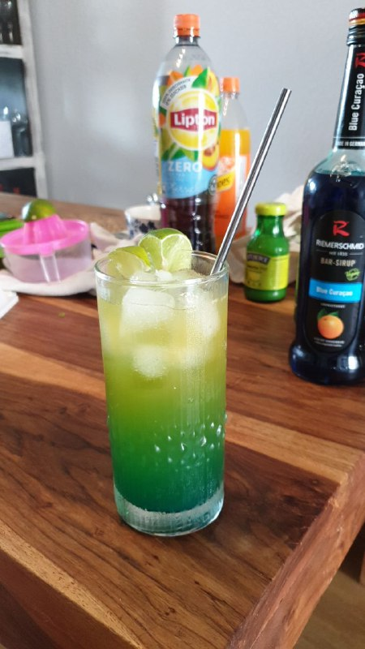

+++
title = "kleiner Diktator"
menu = "recipes"
type = "containered"
+++

<h2>
    "Kleiner Diktator"  
</h2>
      <b>Zutaten:</b>  
    1/3 Bitter lemon  
    1/3 bitter orange  
    1/4 lipton  
    Schuss Limettensaft  
    2x Schuss Waldmeister  
    Schuss Blue Curaçao Blue virgin  
      <b>Zubereitung:</b>
      
    

